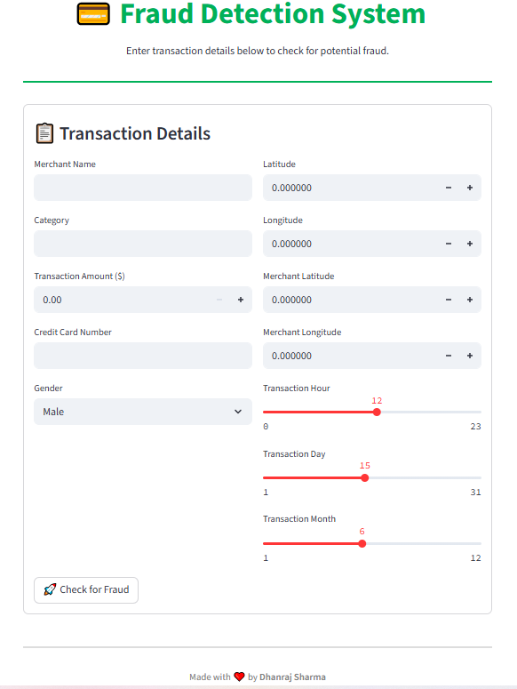
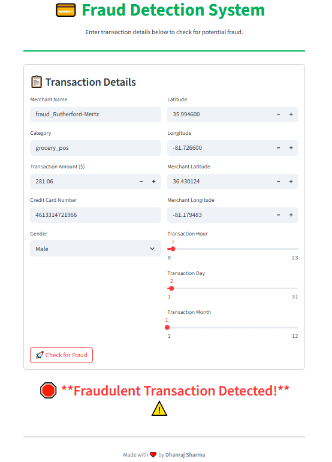
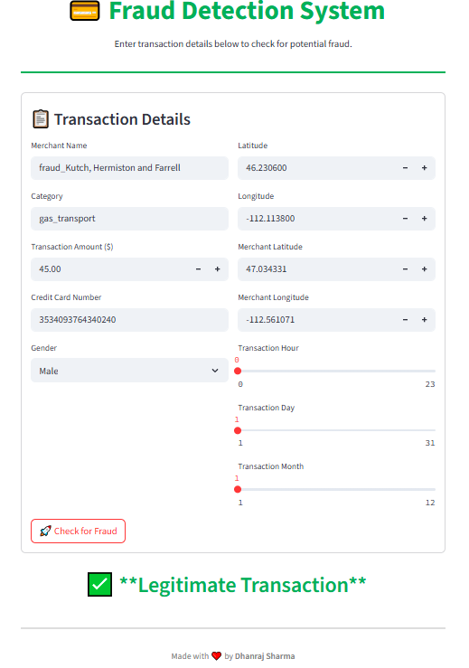
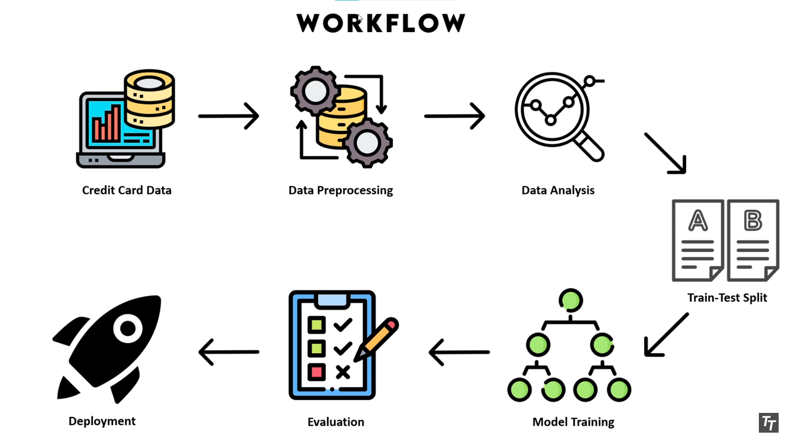

# 💳 Credit Card Fraud Detection System

### **NOTE ⚠️**
This app is trained on the dataset provided and is for **educational/demo use only**. It won't catch live banking fraud without production-grade data integration and real-time monitoring!


> ***Secure transactions, one prediction at a time.***
> https://credit-card-fraud-detection-nddimension.streamlit.app/

Fraud costs billions every year. The **Credit Card Fraud Detection System** empowers you to **identify potentially fraudulent transactions using AI**. Whether you're a data scientist, developer, or curious user—our model helps you **detect anomalies in payment data** with machine learning.


## 📸 App Preview 🌟



## Fraud Transaction 



## Legitimate Transaction



## 🚀 Why Credit Card Fraud Detection?

 "*Stopping fraud is cheaper than cleaning it up..*"
Our system uses feature engineering, geolocation analysis, and **LightGBM** with **SMOTE** to build a robust fraud classifier.

> 💡 Enter transaction details.
> 🎯 Click a button.
> 🔍 Instantly see fraud prediction.

✅ No complicated APIs
✅ No manual rules
✅ Just AI-based prediction

## 📌 Workflow

- Data Cleaning & Feature Engineering

- SMOTE Resampling

- LightGBM Training

- Model Saving (joblib)

- Streamlit Frontend for Inference




## 🧠 How It Works

1. **Preprocessing:** Extracts features like hour, day, merchant, category, and geolocation distance between user and merchant.

2. **Balancing Data:** Uses **SMOTE** to oversample minority (fraud) class for better training.

3. **Model Training:** Uses **LightGBM Classifier**, optimized for imbalanced data.

4. **Prediction:** Given transaction inputs, model outputs `Fraudulent` or `Legitimate`.

⚡ All with fast, efficient code and an interactive UI.


## 🧰 Features

| Function                | Description                                         |
| ----------------------- | --------------------------------------------------- |
| 📍 Geolocation Distance | Calculates user–merchant distance via Haversine     |
| 📈 Feature Engineering  | Extracts hour, day, month from timestamps           |
| ⚖️ SMOTE Balancing      | Handles class imbalance for better learning         |
| 🌳 LightGBM Model       | Fast, robust gradient boosting on tabular data      |
| 🎛️ Streamlit UI        | User-friendly, interactive web app                  |
| 💾 Model Persistence    | Uses `joblib` to save/load trained model & encoders |


## 📦 Requirements

```txt
pandas
numpy
scikit-learn
lightgbm
imbalanced-learn
geopy
joblib
seaborn
matplotlib
streamlit
```

Install everything using:
```bash
pip install -r requirements.txt
```


## ⚙️ Getting Started

1️⃣ **Clone the repository**
```bash
git clone https://github.com/NDDimension/Credit-Card-Fraud-Detection.git
cd Credit-Card-Fraud-Detection/Code
```

2️⃣ **Download and prepare your dataset**
- Use your CSV data with transaction details.
```link
https://drive.google.com/file/d/1118Jwzj51KpXd0T5jiebn9ykCygwbkhn/view
```

- Example columns used: `merchant`, `category`, `amount`, `cc_num`, `geolocation`, `timestamp`, etc.

3️⃣ **Train the Model**
```
fraud_detection.ipynb
```
- The notebook handles:

    - Preprocessing

    - Feature engineering

    - SMOTE oversampling

    - LightGBM training

    - Model saving

4️⃣ **Run the Streamlit App**
```bash
streamlit run app.py
```

5️⃣ **Use the App**

- Fill in transaction details from the dataset.

- Get real-time fraud prediction!


## ✨ Highlights

- ✅ Minimal setup — just clone and run
- ✅ Geolocation-based distance features
- ✅ Balanced training with SMOTE
- ✅ Efficient LightGBM model
- ✅ Interactive Streamlit UI
- ✅ Easy to retrain with new data


## 🔮 What’s Coming

- 📈 Integrate live transaction data

- 🔐 Add user authentication

- 🗺️ Map visualizations of fraud clusters

- 📱 Mobile-ready UI

- 🌍 Multi-language support


### 🧠 Powered by:

- scikit-learn

- LightGBM

- imbalanced-learn (SMOTE)

- geopy

- pandas

- Streamlit

- joblib


## 📜 License

Licensed under the [MIT License](LICENSE).


> **Credit Card Fraud Detection System** —*Stop fraud before it starts.*

> ❤️ Made with love by **Dhanraj Sharma**.
